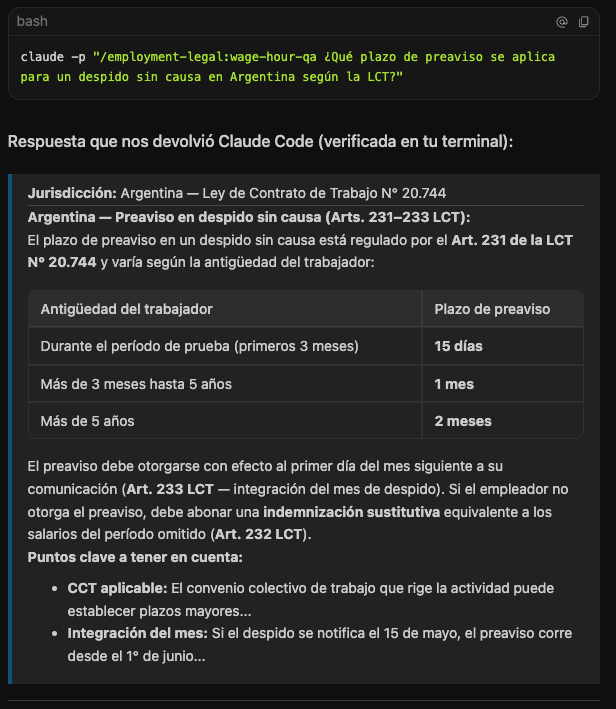

# Claude for Legal - Argentina 🇦🇷 (Adaptación a normativa local y versión agnóstica / Local adaptation & agnostic aersion)

[](LICENSE)
[](#)
[](#)

Esta es una adaptación y extensión del repositorio original `anthropics/claude-for-legal` para la República Argentina, ajustada a su marco regulatorio, normativo y comercial (BORA, InfoLEG, AFIP, BCRA, CNV, LCT, Ley de Protección de Datos Personales 25.326, CCyCN, etc.).  
*This is an adaptation and extension of the original `anthropics/claude-for-legal` repository for the Argentine Republic, adjusted to its regulatory, normative, and commercial framework (BORA, InfoLEG, AFIP, BCRA, CNV, LCT, Personal Data Protection Law 25,326, CCyCN, etc.).*



Además de mantener la estructura original compatible con **Claude Code** y **Claude Desktop/Cowork**, se incluye una **versión agnóstica de prompts e instructivos de sistema** para utilizar esta inteligencia legal en cualquier otro cliente o modelo (como OpenCode, Aider, ChatGPT, Claude.ai, etc.).  
*In addition to maintaining the original structure compatible with **Claude Code** and **Claude Desktop/Cowork**, an **agnostic version of prompts and system instructions** is included to use this legal intelligence in any other client or model (such as OpenCode, Aider, ChatGPT, Claude.ai, etc.).*

---

## Adaptaciones Clave (Marco Normativo) / Key Adaptations (Regulatory Framework)

El repositorio localiza el análisis legal en las siguientes áreas críticas:  
*The repository localizes legal analysis in the following critical areas:*

*   **Laboral (`employment-legal`):** Despidos e indemnizaciones bajo la LCT N° 20.744 (antigüedad Art. 245, preaviso Art. 232, integración del mes Art. 233, protecciones por maternidad/matrimonio), encuadre de monotributistas (Art. 23 LCT) y horas extras (Ley 11.544).  
    *Labor (`employment-legal`): Dismissals and severance pay under LCT No. 20,744 (severance Art. 245, notice Art. 232, month integration Art. 233, maternity/marriage protection), worker classification of monotributistas (Art. 23 LCT), and overtime (Law 11,544).*
*   **Privacidad (`privacy-legal`):** Procesamiento de solicitudes de derechos ARCO bajo la Ley 25.326. Respuestas estrictas en 10 días corridos (Acceso) y 5 días hábiles (Supresión/Rectificación) sin prórrogas automáticas.  
    *Privacy (`privacy-legal`): Processing of ARCO rights requests under Law 25,326. Strict response times of 10 calendar days (Access) and 5 business days (Deletion/Rectification) without automatic extensions.*
*   **Societario (`corporate-legal`):** Actas y resoluciones por escrito según la Ley General de Sociedades N° 19.550 y Art. 158 del CCyCN. Abstención de directores por conflicto de interés (Art. 272 LGS).  
    *Corporate (`corporate-legal`): Minutes and written resolutions under General Corporations Law No. 19,550 and Art. 158 of the CCyCN. Abstention of directors due to conflict of interest (Art. 272 LGS).*
*   **Comercial (`commercial-legal`):** Firma digital vs. electrónica (Ley 25.506) y cláusulas de dolarización/pesificación (protección ante el Art. 765 del CCyCN y prórrogas de jurisdicción Art. 2605).  
    *Commercial (`commercial-legal`): Digital vs. electronic signature (Law 25,506) and dollarization/pesification clauses (protection against Art. 765 of the CCyCN and jurisdiction clauses Art. 2,605).*
*   **Propiedad Intelectual (`ip-legal`):** Clearance marcario e investigación de similitud gráfica/fonética/conceptual bajo la Ley de Marcas N° 22.362 y el boletín de oposiciones del INPI (30 días).  
    *Intellectual Property (`ip-legal`): Trademark clearance and graphic/phonetic/conceptual similarity analysis under Trademark Law No. 22,362 and the INPI opposition bulletin (30 days).*

---

## Inicio Rápido / Quick Start

### Opción A: En Claude Code (Plugins) / Option A: In Claude Code (Plugins)
1. **Registra este repositorio como un marketplace local:**  
   *Register this repository as a local marketplace:*
   ```bash
   /plugin marketplace add <ruta-al-repositorio>
   ```
   *(Reemplazá `<ruta-al-repositorio>` por la ruta local donde clonaste este repo, ej. `/Users/tu-usuario/Downloads/claude-for-legal-ar`)*
2. **Instala los plugins que necesites:**  
   *Install the plugins you need:*
   ```bash
   /plugin install employment-legal@claude-for-legal-ar
   /plugin install commercial-legal@claude-for-legal-ar
   ```
3. **Reinicia Claude Code y corre la entrevista inicial:**  
   *Restart Claude Code and run the initial setup interview:*
   ```bash
   /employment-legal:cold-start-interview
   ```

### Opción B: En Otros Clientes/Modelos (Suite Agnóstica) / Option B: In Other Clients/Models (Agnostic Suite)
Si usas OpenCode, Aider o ChatGPT, puedes usar directamente los prompts Markdown autoportantes y el ejecutor Python:  
*If you use OpenCode, Aider, or ChatGPT, you can directly use the self-contained Markdown prompts and the Python runner:*
```bash
cd agnostic-legal-ar
export ANTHROPIC_API_KEY="tu-api-key"
python3 harness/run_agnostic.py --prompt laboral_lct --input tu_documento.txt
```

---

## Estructura del Repositorio / Repository Structure

*   **`agnostic-legal-ar/`** - Suite de prompts y runner de Python desacoplados de Claude Code. **No es un plugin instalable** — ver [agnostic-legal-ar/README.md](./agnostic-legal-ar/README.md). / *Agnostic prompt suite and Python runner — not a Claude Code plugin.*
*   **`[plugin-name]-legal/`** - Plugins de especialidad para Claude Code/Cowork (instalables con `/plugin install`). / *Specialty plugins for Claude Code/Cowork (installable via `/plugin install`).*
*   **`references/`** - Catálogo de fuentes legales oficiales de Argentina (`ar-legal-catalog.md`), dashboard template, y company profile template. Las imágenes de documentación se guardan en `references/images/`. / *Catalog of official Argentine legal sources, dashboard template, and documentation images.*
*   **`managed-agent-cookbooks/`** - Recetas para desplegar agentes automáticos en la nube. / *Cookbooks for deploying managed agents in the cloud.*
*   **`docs/`** - Documentación extendida y guías de referencia. / *Extended documentation and reference guides.*

---

## Roadmap de Normas Argentinas / Argentine Laws Roadmap

### ✅ Implementadas por Plugin / Implemented by Plugin

#### Laboral (`employment-legal`)
| Norma | Temas Cubiertos |
|---|---|
| **LCT N° 20.744** (Ley de Contrato de Trabajo) | Despidos, indemnizaciones (Art. 245), preaviso (Art. 231/232), integración mes (Art. 233), vacaciones (Art. 156+), licencias (maternidad Art. 177/178, matrimonio Art. 180/181, enfermedad Art. 208), período de prueba (Art. 88), certificados (Art. 80) |
| **Ley 11.544** | Jornada laboral (8h/48h), horas extras (50%/100%) |
| **Ley 23.041** | SAC (Sueldo Anual Complementario / Aguinaldo) |
| **Ley 23.551** | Tutela sindical, estabilidad de representantes gremiales |
| **Ley 24.013** | PPC (Procedimiento Preventivo de Crisis) para despidos masivos |
| **Ley 25.323** | Multas por registración deficiente |
| **Ley 25.345** | Multa Art. 80 LCT (3 salarios por no entregar certificados) |
| **Ley 23.590 / 23.592** | No discriminación en empleo, sanciones penales |
| **Ley 27.555** | Teletrabajo, derecho a la desconexión, reversibilidad |
| **Ley 26.485** | Violencia laboral, protocolo de acoso obligatorio |
| **Ley 27.401** | Responsabilidad penal corporativa, programa de integridad |
| **CCT** (Convenios Colectivos de Trabajo) | Salarios mínimos convencionales, condiciones por sector |
| **ANSES / ART** | Seguridad social, Aseguradora de Riesgos del Trabajo |

#### Privacidad (`privacy-legal`)
| Norma | Temas Cubiertos |
|---|---|
| **Ley 25.326** (Protección de Datos Personales) | Derechos ARCO, plazos (10 días acceso, 5 días supresión), habeas data (Art. 37+), transferencias internacionales (Art. 12), datos sensibles (Art. 7) |
| **Ley 26.529** (Derechos del Paciente) | Datos de salud, régimen especial |
| **AAIP** (Agencia de Acceso a la Información Pública) | Autoridad de aplicación, multas, denuncias administrativas |

#### Societario (`corporate-legal`)
| Norma | Temas Cubiertos |
|---|---|
| **LGS N° 19.550** (Ley General de Sociedades) | Sociedades (SA, SRL, SAS), libros societarios (Art. 175), asambleas (Art. 60), actas de directorio (Art. 73), compraventa de acciones |
| **CCyCN Art. 158** | Resoluciones por escrito (unanimidad + autorización estatutaria) |
| **CCyCN Art. 272** | Conflicto de interés de directores |
| **Ley 27.430** | Impuesto a las Ganancias (régimen societario) |
| **Ley 26.831** (Mercado de Capitales) | Entidades que emiten valores negociables, reporting CNV |
| **IGJ / DPPJ** | Inspección General de Justicia (CABA), Dirección Provincial de Personas Jurídicas (Buenos Aires) |
| **AFIP** | CUIT, constancia de situación tributaria, obligaciones impositivas |
| **CNV** (Comisión Nacional de Valores) | Comunicaciones A-series, insider trading |
| **BYMA / ROFEX** | Bolsas y mercados argentinos |

#### Comercial (`commercial-legal`)
| Norma | Temas Cubiertos |
|---|---|
| **CCyCN** (Código Civil y Comercial) | Contratos (Art. 957+), buena fe (Art. 962), lesión (Art. 966), pesificación (Art. 765/766), jurisdicción internacional (Art. 2605) |
| **Ley 25.506** | Firma digital (criptografía asimétrica) vs. firma electrónica |
| **Ley 24.240** (Defensa del Consumidor) | Publicidad engañosa (Art. 4), cláusulas abusivas (Art. 37), derecho de revocación |
| **Ley 22.802** (Lealtad Comercial) | Prácticas desleales, competencia desleal |
| **Ley 24.766** | Secreto industrial, know-how |

#### Propiedad Intelectual (`ip-legal`)
| Norma | Temas Cubiertos |
|---|---|
| **Ley 22.362** (Marcas) | Registro, oposiciones (30 días Boletín), obstáculos absolutos (Art. 2/3), penalidades (Art. 31) |
| **Ley 11.723** (Derechos de Autor) | Registro DNDA, penalidades (Art. 72) |
| **Ley 24.481** | Patentes de invención y modelos de utilidad |
| **INPI** | Registro de marcas, patentes, diseños industriales |

#### Productos Digitales (`product-legal`)
| Norma | Temas Cubiertos |
|---|---|
| **Ley 24.240** | Defensa del consumidor, publicidad engañosa |
| **Ley 22.802** | Lealtad comercial, comparaciones engañosas |
| **Ley 25.326** | Datos personales en productos digitales |
| **Ley 26.904** | Protección de menores online (grooming) |
| **Ley 26.061** | Protección integral de derechos de niñas, niños y adolescentes |
| **ENACOM** | Regulaciones sobre servicios digitales y telecomunicaciones |
| **Defensoría del Público** | Recomendaciones sobre contenido mediático |
| **CONAR Argentina** | Código de Ética de Autodisciplina Publicitaria |

#### Gobernanza de IA (`ai-governance-legal`)
| Norma | Temas Cubiertos |
|---|---|
| **Ley 25.326 Art. 11** | Decisiones automatizadas que afectan derechos individuales |
| **Ley 24.240** | Protección al consumidor en sistemas de IA |
| **AAIP** | Guidelines sobre decisiones automatizadas |
| **BCRA / CNV** | Reguladores sectoriales (fintech, mercados de capitales) |

#### Litigios (`litigation-legal`)
| Norma | Temas Cubiertos |
|---|---|
| **CPCCN Art. 380+** | Secreto profesional, privilegios |
| **Ley 23.118** | Secreto profesional del abogado |
| **CPCCN Art. 192+** | Medidas cautelares |
| **CPCCN Art. 387-390** | Exhibición de documentos |
| **Ley 11.683** | Procedimiento tributario (retención 6 años) |

#### Regulatorio (`regulatory-legal`)
| Norma | Temas Cubiertos |
|---|---|
| **InfoLEG** | Sistemas de información legal |
| **Boletín Oficial** | Publicación de edictos y normas |
| **AAIP / CNV / BCRA / ENACOM / ANMAT** | Reguladores sectoriales |

### ⏳ Pendientes / Pending

| Norma | Área | Notas |
|---|---|---|
| **Ley 27.610** (Interrupción Voluntaria del Embarazo) | Laboral | Licencia IVE |
| **Ley 26.150** (Educación Sexual Integral) | Laboral | Capacitación obligatoria |
| **Ley 27.636** (Régimen de Promoción del Acceso al Empleo Formal) | Laboral | Incentivos de contratación |
| **Ley 25.561** (Emergencia Pública) | Comercial | Pesificación, cláusulas de emergencia |
| **DNU 70/2023 + Ley 27.551 derogada** | Comercial | Reforma de alquileres: derogación del índice ICL y del plazo mínimo de 3 años para locaciones comerciales |
| **Ley 27.742** (Ley Bases — "Bases y Puntos de Partida para la Libertad de los Argentinos") | Multi-área | Reformas estructurales 2024: impacto en empleo (RIGI), societario y regulatorio |
| **Ley 24.557** (Riesgos del Trabajo) | Laboral | ART, accidentes de trabajo, enfermedades profesionales |
| **Código Aduanero (Ley 22.415)** | Comercial | Importación/exportación |
| **Ley 25.156** (Defensa de la Competencia) | Comercial | Antitrust, concentraciones económicas |
| **Ley 22.262** (Penalidades Tributarias) | Corporativo | Infracciones impositivas |
| **Ley 27.430** (actualizaciones) | Corporativo | Modificaciones al impuesto a las ganancias |
| **Resoluciones IGJ específicas** | Corporativo | Requisitos por tipo societario |
| **Resoluciones AAIP específicas** | Privacidad | Procedimientos de denuncia, modelos de cláusulas |
| **Normativa provincial específica** | Multi-área | Cada provincia tiene su propio CPPJ, rentas, etc. |

---

## Documentación y Licencia / Documentation & License

*   Para consultar el manual de uso extendido de todos los conectores, plugins oficiales originales y configuraciones avanzadas, lee la [Guía de Referencia Completa (Original)](./docs/original_reference.md).  
    *To consult the extended user manual for all connectors, original official plugins, and advanced configurations, read the [Complete Reference Guide (Original)](./docs/original_reference.md).*
*   Para ver el catálogo detallado de fuentes de información y reguladores argentinos, consulta el [Catálogo de Fuentes Legales Argentinas](./references/ar-legal-catalog.md).  
    *To see the detailed catalog of information sources and Argentine regulators, consult the [Argentine Legal Sources Catalog](./references/ar-legal-catalog.md).*

Licensed under the [Apache License, Version 2.0](LICENSE).

Copyright 2026 Anthropic PBC.  
Adaptación para la República Argentina y Suite Agnóstica Copyright 2026 lbyache.
