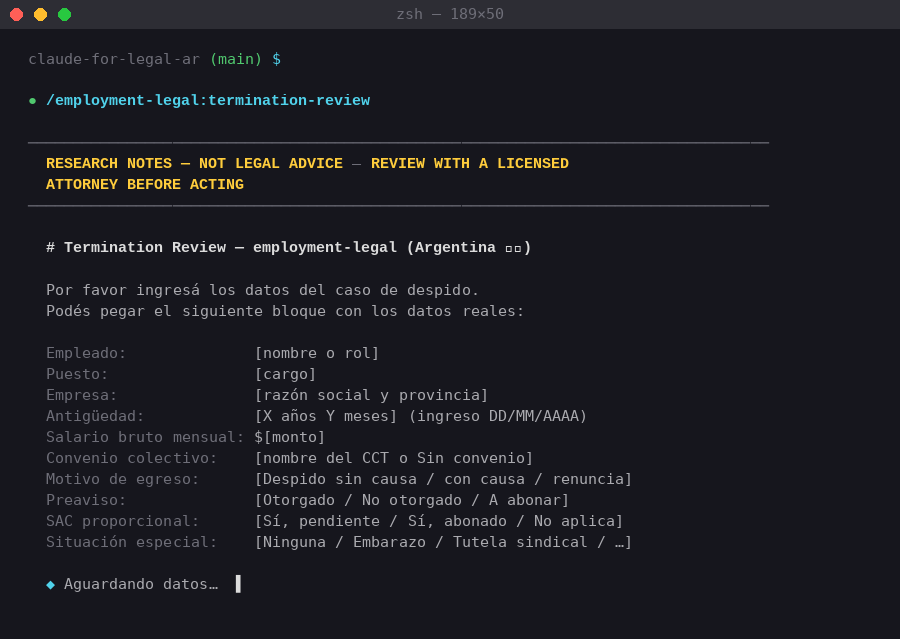
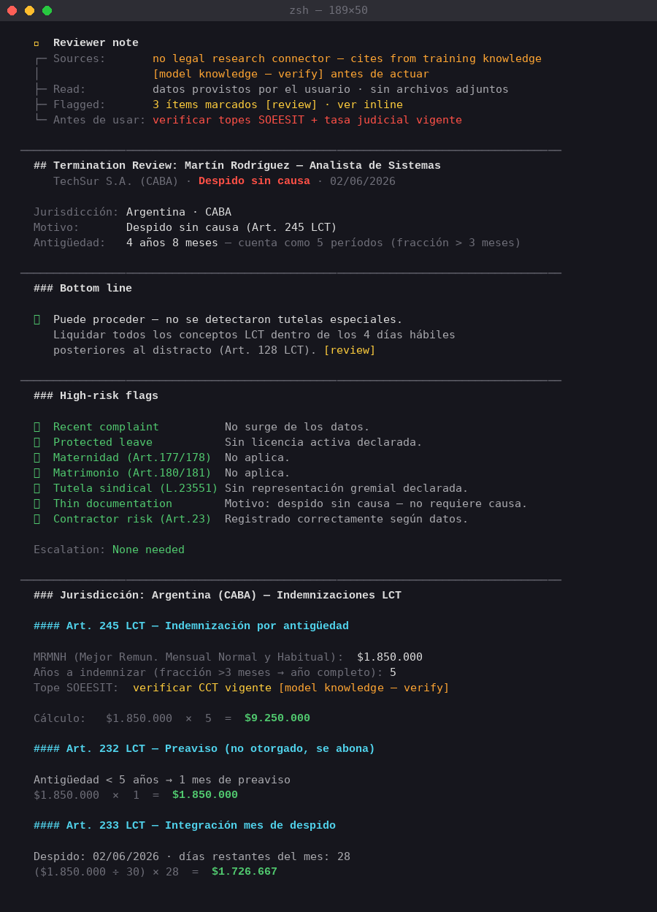
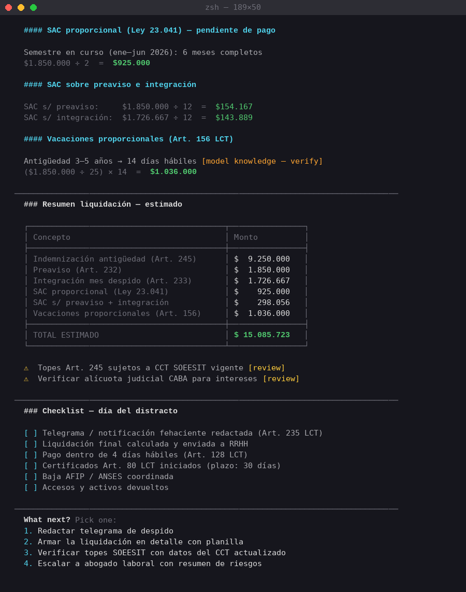

# Tutorial: Plugin `employment-legal` — Revisión de Despidos bajo LCT 🇦🇷

> **Para quién es este tutorial**
> - 👩‍💼 **Abogados / usuarios finales:** seguí la [Guía de Uso Rápido](#guía-de-uso-rápido-para-abogados) — no necesitás saber programar.
> - 🧑‍💻 **Developers:** arrancá desde [Instalación Técnica](#instalación-técnica).

---

## ¿Qué hace este plugin?

El plugin `employment-legal` analiza despidos laborales en Argentina aplicando automáticamente la **Ley de Contrato de Trabajo N° 20.744 (LCT)** y normativa complementaria. A partir de los datos del caso, calcula:

- Indemnización por antigüedad (Art. 245 LCT)
- Preaviso (Arts. 231/232) e integración del mes de despido (Art. 233)
- SAC proporcional (Ley 23.041)
- Multas por falta de entrega de certificados (Art. 80 LCT / Ley 25.345)
- Doble indemnización si aplica (Ley 25.972 / DNU 34/2019)
- Tutela sindical y protecciones especiales (maternidad, matrimonio, etc.)

El skill principal se llama **`termination-review`**.

---

## Instalación Técnica

> Requisito previo: tener [Claude Code](https://docs.anthropic.com/claude-code) instalado y configurado con tu API key.

### 1. Cloná el repositorio

```bash
git clone https://github.com/lbyache/claude-for-legal-ar.git
cd claude-for-legal-ar
```

### 2. Registrá el repositorio como marketplace local

Abrí Claude Code y ejecutá:

```
/plugin marketplace add <ruta-absoluta-al-repo>
```

Ejemplo en macOS:

```
/plugin marketplace add /Users/tu-usuario/Documents/claude-for-legal-ar
```

> **¿Por qué?** Claude Code necesita saber dónde están los plugins antes de poder instalarlos.

### 3. Instalá el plugin

```
/plugin install employment-legal@claude-for-legal-ar
```

### 4. Verificá la instalación

```
/plugin list
```

Deberías ver `employment-legal` en la lista. Si no aparece, reiniciá Claude Code.

---

## Guía de Uso Rápido para Abogados

Una vez que un developer instaló el plugin, vos solo necesitás tres pasos.

### Paso 1 — Abrí Claude Code en el repo

```bash
cd ~/Documents/repositorios/claude-for-legal-ar
claude
```

> Si es la primera vez, pedile a tu equipo técnico que complete la instalación de arriba.

### Paso 2 — Lanzá el skill de revisión de despidos

Escribí este comando en Claude Code:

```
/employment-legal:termination-review
```

Claude te va a pedir los datos del caso.



*↑ Captura: Claude Code esperando los datos del caso tras ejecutar el skill.*

---

### Paso 3 — Ingresá los datos del caso

Pegá los datos en el siguiente formato (podés copiar este bloque y reemplazar con los datos reales):

```
Empleado: [Nombre completo]
Puesto: [Cargo]
Empresa: [Razón social y provincia]
Antigüedad: [X años Y meses] (ingreso DD/MM/AAAA)
Salario bruto mensual: $[monto]
Convenio colectivo: [nombre del CCT o "Sin convenio"]
Motivo de egreso: [Despido sin causa / con causa / renuncia / etc.]
Preaviso: [Otorgado / No otorgado / A abonar en lugar de preaviso]
SAC proporcional: [Sí, pendiente / Sí, abonado / No aplica]
Situación especial: [Ninguna / Embarazo / Tutela sindical / etc.]
```

**Ejemplo real:**

```
Empleado: Martín Rodríguez
Puesto: Analista de sistemas
Empresa: TechSur S.A. (CABA)
Antigüedad: 4 años y 8 meses (ingreso 01/10/2021)
Salario bruto mensual: $1.850.000
Convenio colectivo: SOEESIT (sistemas)
Motivo de egreso: Despido sin causa
Preaviso: No otorgado (se abonará en lugar de preaviso)
SAC proporcional: Sí, pendiente de pago
Situación especial: Ninguna
```

---

### Paso 4 — Leé el análisis

Claude procesa los datos y devuelve un análisis estructurado. La sección más importante es la zona de **cálculos y reviewer notes**:



*↑ Captura: Detalle del output con el ⚠️ Reviewer Note y el cálculo de indemnización por antigüedad (Art. 245 LCT). Esta zona resume los montos y los artículos aplicados.*

El análisis incluye:

| Sección | Qué muestra |
|---|---|
| ⚠️ **Reviewer Note** | Alertas sobre datos faltantes o situaciones que requieren revisión manual |
| **Art. 245 LCT** | Cálculo de indemnización por antigüedad |
| **Arts. 232/233** | Preaviso e integración del mes |
| **SAC proporcional** | Monto del aguinaldo adeudado |
| **Art. 80 / Ley 25.345** | Multa por certificados si aplica |
| **Total estimado** | Suma de todos los conceptos |

---

## Ejemplo de Output Completo

A continuación se muestra un extracto representativo del análisis generado para el caso de Martín Rodríguez:



*↑ Captura: Análisis completo. Para una mejor visualización, agrandá la ventana del terminal antes de ejecutar el skill.*

> **Tip:** Si el output se ve muy angosto o cortado, expandí la ventana del terminal al máximo ancho antes de correr el skill.

---

## Comandos del Plugin

| Comando | Descripción |
|---|---|
| `/employment-legal:termination-review` | Análisis de despido con cálculo de liquidación |
| `/employment-legal:cold-start-interview` | Configuración inicial: ingresás el perfil de tu empresa y convenios habituales |

---

## Preguntas Frecuentes

**¿Los cálculos son definitivos?**  
No. El output es una estimación orientativa basada en los datos que ingresaste. Siempre revisá con criterio profesional, especialmente si hay convenios colectivos con salarios mínimos superiores al básico declarado.

**¿Qué pasa si hay tutela sindical?**  
Indicalo en el campo `Situación especial`. El skill aplica automáticamente la protección del Art. 52 de la Ley 23.551 y calcula la indemnización agravada.

**¿Funciona con otras jurisdicciones (Buenos Aires, Córdoba, etc.)?**  
La LCT es federal, así que los cálculos aplican a todo el país. Lo que varía por provincia son los juzgados competentes y algunos convenios locales.

**¿Puedo analizar más de un caso seguido?**  
Sí. Volvé a ejecutar `/employment-legal:termination-review` para cada caso nuevo. Cada ejecución es independiente.

---

## Recursos

- [README del repositorio](./README.md)
- [Catálogo de fuentes legales argentinas](./references/ar-legal-catalog.md)
- [LCT N° 20.744 — InfoLEG](https://www.infoleg.gob.ar/infolegInternet/anexos/25000-29999/25552/texact.htm)
- [SOEESIT — Convenio colectivo sistemas](https://www.soeesit.org.ar)

---

*Tutorial generado para `claude-for-legal-ar` · Licencia Apache 2.0 · Adaptación Argentina por lbyache*
